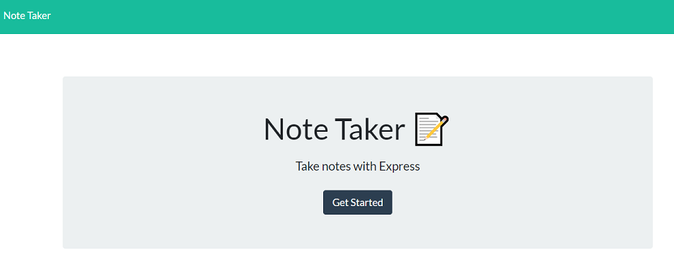
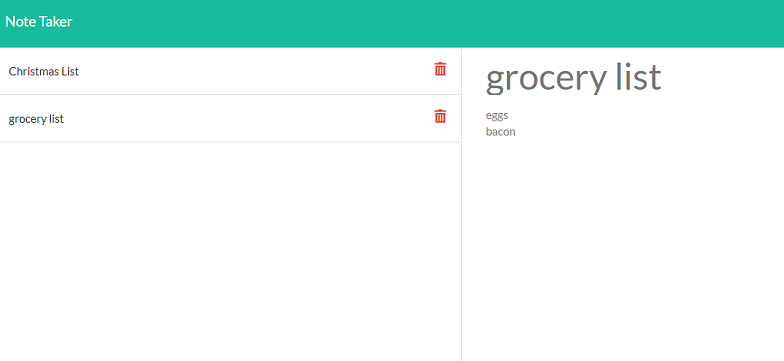
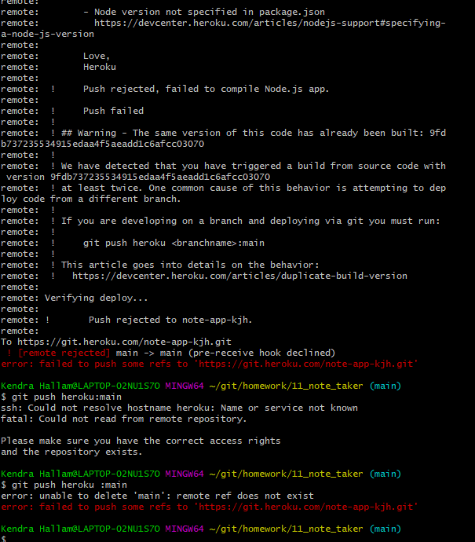

# 🔗 [NOTE TAKER](https://github.com/kjhallam/11_note_taker)

## LICENSE


---

##  DESCRIPTION

```
AS A user, I want to be able to write and save notes I WANT to be able to delete notes I've written before SO THAT I can organize my thoughts and keep track of tasks I need to complete.
```

```
Create an application that can be used to write, save, and delete notes. This application will use an express backend and save and retrieve note data from a JSON file. (GET - POST - DELETE)
```

---

## 📋 Table of Contents

  1. [DESCRIPTION](#description)
  2. [INSTALLATION](#installation)
  3. [USAGE](#usage)
  4. [CONTRIBUTING](#contributing)
  5. [TEST](#test)
  6. [GITHUB](#github)
  7. [PREVIEW](#preview)
  8. [SCREENSHOTS](#screenshots)
  9. [QUESTIONS](#questions)
  
---

## INSTALLATION

- Installed NPM I
- NPM I Express
- NPM I UUID

* Run node server.js to retrieve the PORT successfully. Then open a web browser of your choice and type localhost:{PORT}.
* Run nodemon in your terminal will also help while installing and running the above NPMs.

---

## USAGE

Application should allow users to create and save notes. Application should allow users to view previously saved notes. Application should allow users to delete previously saved notes.

---

## CONTRIBUTING

n/a

---

## TEST

No test were required for the Note Taker assignment.

---

## GITHUB

[https://github.com/kjhallam](http://github.com/https://github.com/kjhallam)

---

## PREVIEW


---

## SCREENSHOTS




---

## CONFLICTS

I encountered multiple errors while trying to deploy to Heroku. One of which was missing the root (route) in my html routes file.

```
router.get('*', function(req, res) {
    res.sendFile(path.join(__dirname, '../public/index.html'))
});
```
I was also missing the node_module in my gitignore file. (See below image for example)


## QUESTIONS

If any questions concerning the use of the markdown file contact me at ✉️ [Email](kjhallam321@gmail.com).
